<!--  Smart_Appointment_System Bug testing -->

# Appointment System – Bug Testing Report

This document presents a structured and well-documented list of issues discovered during functional and UI testing of the Appointment System. All findings are categorized and explained for better clarity, including screenshots for reference.

---

## 📚 Table of Contents

- [🔐 User: Admin](#user-admin)
  - [📋 Appointment Module](#appointment-module)
    - [🐞 Bug 1: Phone Field Validation](#bug-1-phone-field-validation)
    - [🐞 Bug 2: Slot Booking – No Clear/Delete Option](#bug-2-slot-booking--no-cleardelete-option)
    - [🐞 Bug 3: Doctor Schedule Visibility Discrepancy](#bug-3-doctor-schedule-visibility-discrepancy)
    - [🐞 Bug 4: Minor – No Phone Field Regulation](#bug-4-minor--no-phone-field-regulation)
    - [🐞 Bug 5: View Appointments Link Not Working](#bug-5-view-appointments-link-not-working)
- [🐞 Major Bug: Doctor Leave & Slot Logic](#major-bug-doctor-leave--slot-logic)
  - [🐞 In Depth Analysis – Patient Records Missing](#in-depth-analysis-report--patient-records-missing-from-all-patient-list)
- [🧑‍💼 User: Call Center](#user-call-center)
  - [📅 Appointment Module](#appointment-module-1)
    - [🐞 Bug 6: Autofill Not Working for Doctor Details](#bug-6-autofill-not-working-for-doctor-details)
    - [🐞 Bug 7: Search Not Recognizing Alternative Phone Numbers](#bug-7-search-not-recognizing-alternative-phone-numbers)
- [✅ Recommendations](#recommendations)
- [📌 Notes](#notes)
  
---

## 🔐 User: Admin

### 📋 Appointment Module

#### 🐞 Bug 1: Phone Field Validation

* **Location:** `All Doctor List > Edit` and `Create Doctor`
* **Issue:** The phone number field accepts alphabets and special characters.
* **Expected:** Only numeric input should be accepted.    
## 📸 Bug Screenshot
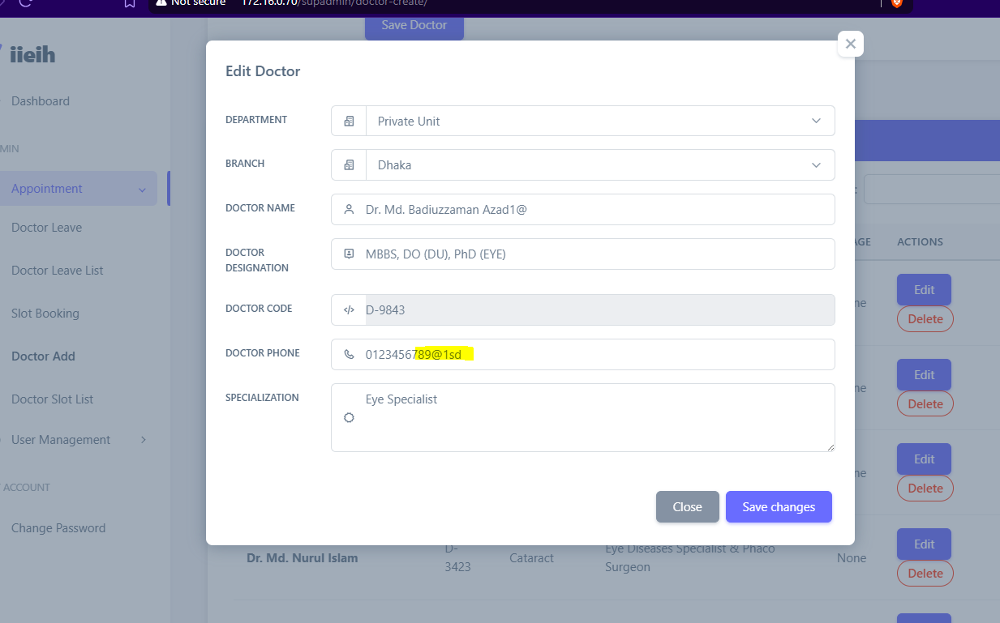
    

#### 🐞 Bug 2: Slot Booking – No Clear/Delete Option

* **Issue:** No button available to clear the entire slot list.
* **Impact:** Admin must manually remove slots one by one.   
## 📸 Bug Screenshot
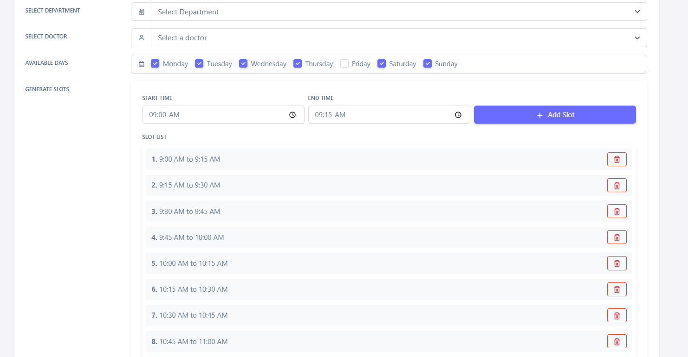
    

#### 🐞 Bug 3: Doctor Schedule Visibility Discrepancy

* **Description:** Admin sets a schedule for a doctor on Friday, but Call Center user cannot see it.
* **Impact:** Appointments cannot be booked for that doctor on Friday.   
## 📸 Bug Screenshot
* **Admin View:**
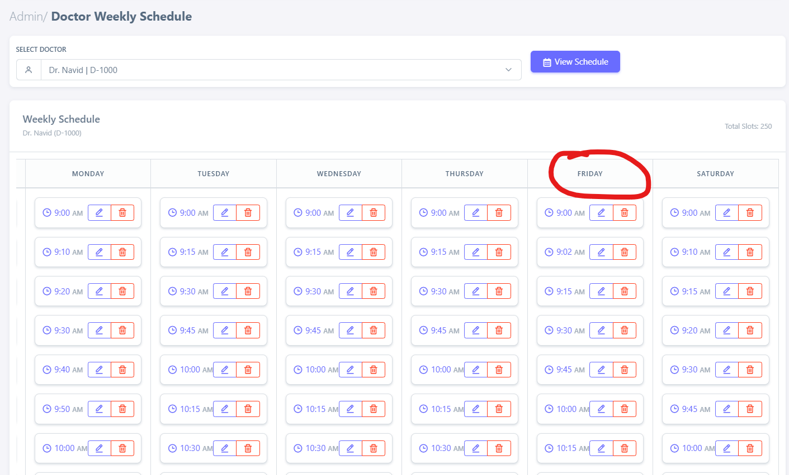
* **Call_center View:**
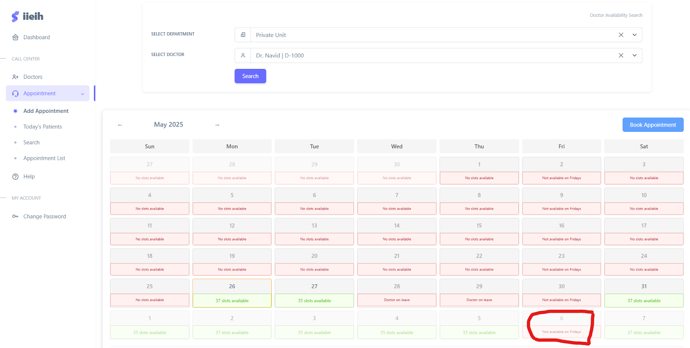
    

#### 🐞 Bug 4: Minor – No Phone Field Regulation

* **Description:** Inconsistent validation when inputting phone numbers.   
## 📸 Bug Screenshot
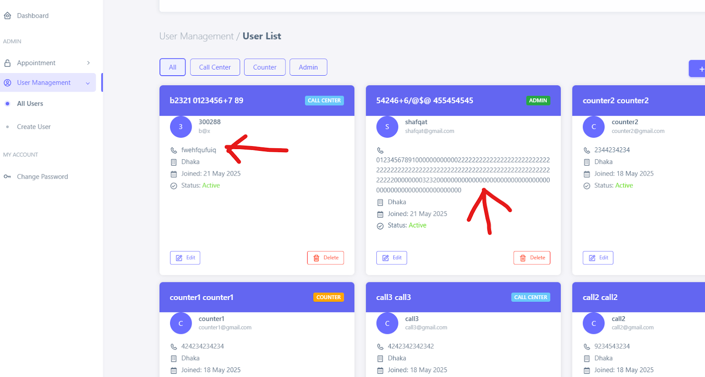
    

#### 🐞 Bug 5: View Appointments Link Not Working

* **Location:** Admin dashboard
* **Issue:** Clicking the link results in no action.   
## 📸 Bug Screenshot
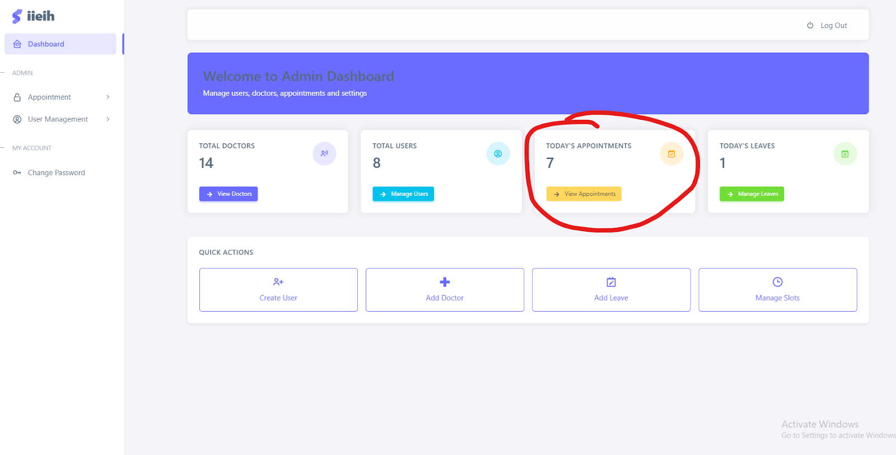
    

---
## 🐞 Major Bug: Doctor Leave & Slot Logic

* **Symptoms:**

  * Doctor on leave can still be assigned to appointments.
  * When slots are full, patients can still be added.
  * Patients whose appointments were scheduled for 9:00 AM and arrived at 2:00 PM disappeared after the doctor went on leave at 1:00 PM.
* **Assumption:** System wrongly marks them as completed.
* **Impact:** Critical patient data loss from "All Patients List".   
## 📸 Bug Screenshot
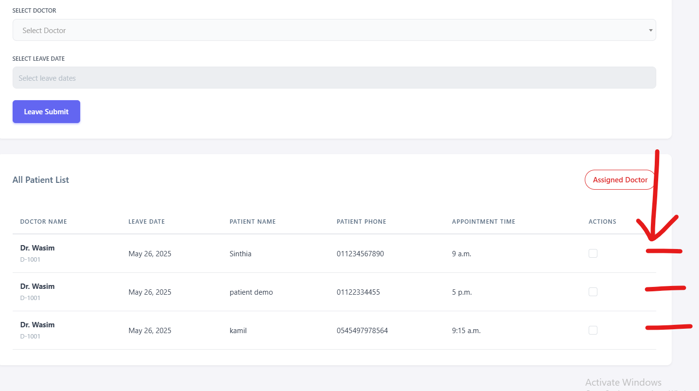
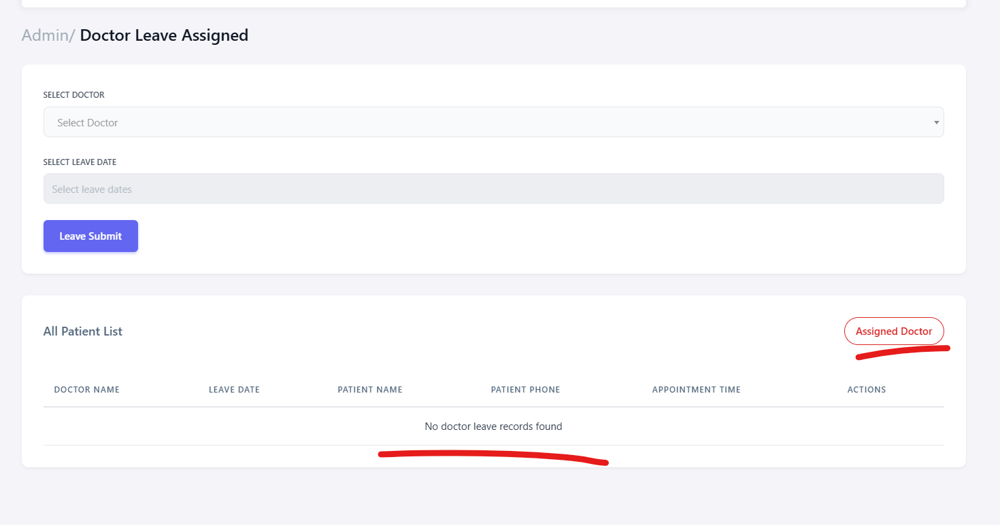
### 🐞 ** In Depth Analysis Report – Patient Records Missing from All Patient List**

**🗓️ Date Found:** 27th May
**🕓 Time Found:** 4:10 PM

#### **Summary:**

A major bug was identified where patients who arrived late (after their scheduled appointment time) were **removed from the “All Patient” list** instead of being reassigned when their doctor took unexpected leave.

#### **Scenario:**

* 3 patients had appointments at **9:00 AM** but arrived at **2:00 PM**.
* At **1:00 PM**, the assigned doctor went on leave.
* The system should have **reassigned these patients** to another available doctor and kept them in the **"All Patient" list**.
* **Instead,** these patients **disappeared from the system**, as if they had been marked as completed.

#### **Root Assumption:**

It seems the system incorrectly assumed the appointments were completed when the doctor went on leave, and thus **removed the patients from the active queue**.

#### **Trigger:**

Assigning a doctor who later **went on leave mid-shift**.

---

.    
## 🧑‍💼 User: Call Center

### 📅 Appointment Module

#### 🐞 Bug 6: Autofill Not Working for Doctor Details

* **Issue:** When an appointment is booked, the selected doctor's name and department are not autofilled.
* **Expected:** Fields should prepopulate based on the selection.   
## 📸 Bug Screenshot
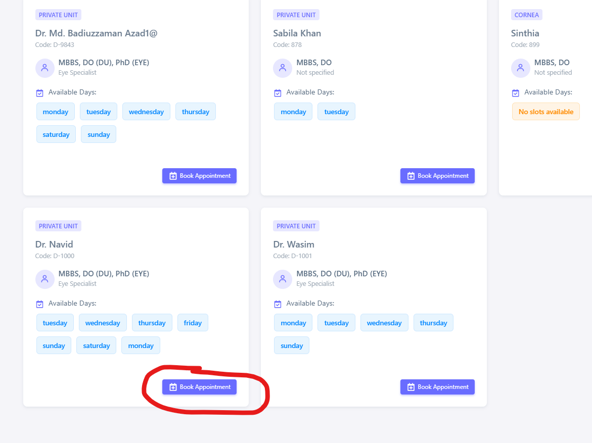
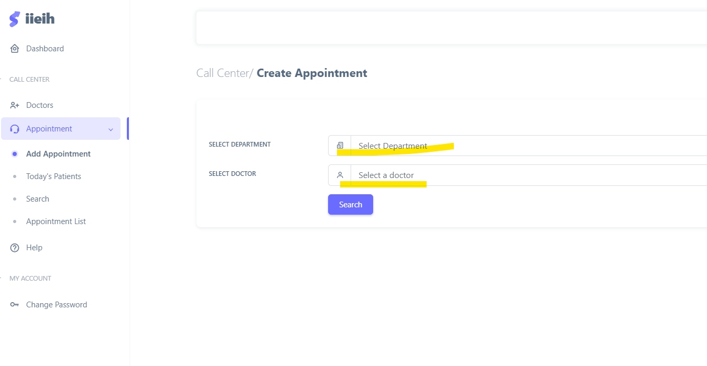
    

#### 🐞 Bug 7: Search Not Recognizing Alternative Phone Numbers

* **Issue:** Patients' alternate numbers cannot be used in the search bar.   
## 📸 Bug Screenshot
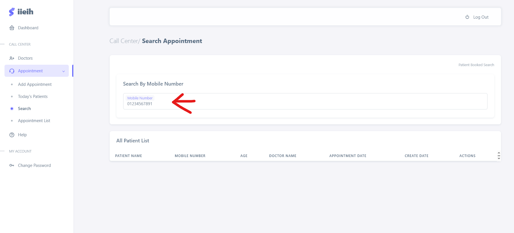
    

---

## Conducted by:

> Shafqat Shahriar Arefin 

---

## ✅ Recommendations
<!--
* Enforce input validation for phone number fields using regex or input masks.
* Implement a "Clear All" button in Slot Booking.
* Synchronize doctor schedules between Admin and Call Center views.
* Disallow appointment creation for doctors on leave or fully booked.
* Log and handle patient reschedules with timestamp-based verification.
* Ensure search functionality indexes both primary and alternate numbers.
-->
---

## 📌 Notes

---

*Last updated after field test on: **May 26, 2025 @ 4:10 PM***
